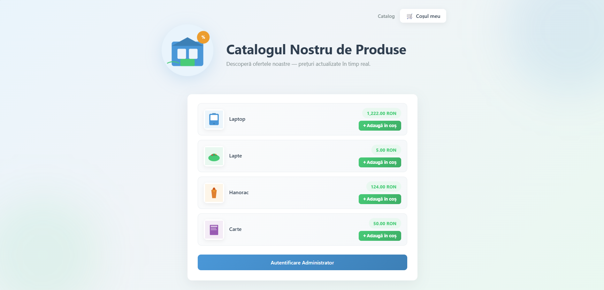
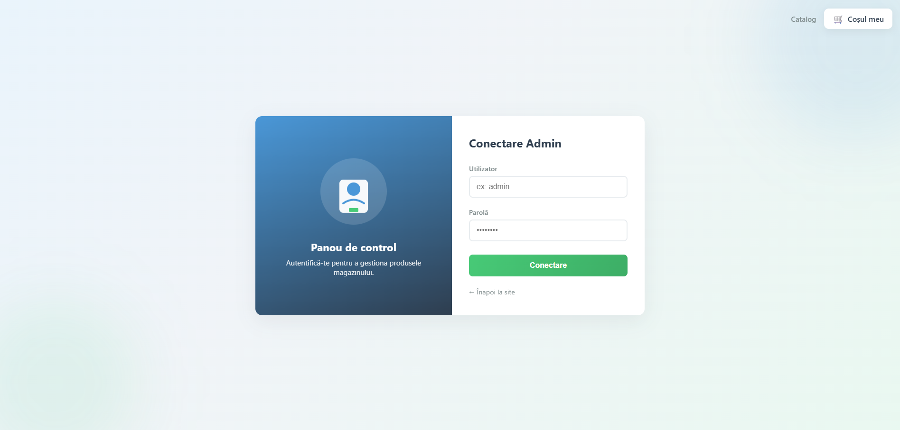

# Product Catalog Project (Web Application Development)

This is a dynamic web application developed in PHP and MySQL designed for managing a product catalog.

## Key Features
* **Public Interface:** Dynamic display of products and prices fetched directly from the MySQL database.
* **Authentication:** Secure login panel restricted to the administrator.
* **Full CRUD Operations:** Capability to Add, Read, Update, and Delete products seamlessly from the admin interface.

## Screenshots

### Main Page (Public View)

### Administration Panel

## How to Run Locally

1. Copy the project folder into your local server directory: `xampp/htdocs/`.
2. Open phpMyAdmin (`http://localhost/phpmyadmin/`) and import the `database.sql` file to set up the database and tables.
3. Open your browser and navigate to: `http://localhost/proiect_php_xampp/index.php`.